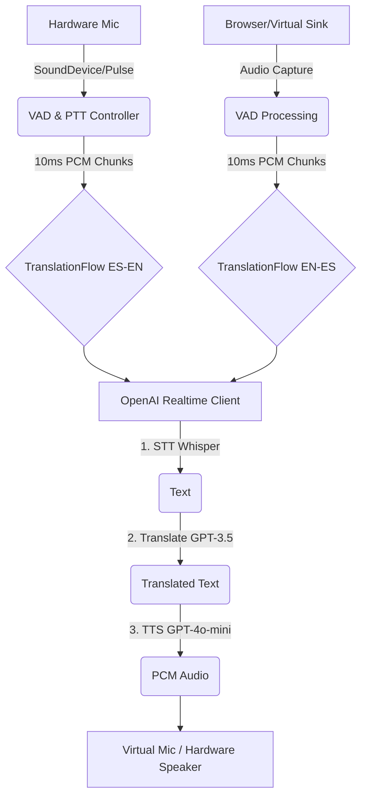

  <h1>🎙️ TraPy: Real-time Bidirectional Voice Translator</h1>
  
<em>Traducción de voz bidireccional en tiempo real para Linux con latencia optimizada.</em>

  
  
  
  

---

## 💡 Why This Matters (Por qué es importante)

Las barreras del idioma en reuniones de trabajo en tiempo real limitan el potencial de colaboración. **TraPy** nace de una necesidad personal real: comunicarse fluidamente en llamadas en inglés. A diferencia de soluciones comerciales cerradas, TraPy intercepta y rutea el audio a nivel de sistema operativo en Linux, actuando como un micrófono y altavoz virtual transparente para cualquier aplicación (Zoom, Meet, Teams).

## 🏗️ Arquitectura Técnica

TraPy utiliza una arquitectura basada en flujos (`TranslationFlow`) completamente desacoplada mediante `asyncio`. Esto permite procesar entrada (ES → EN) y salida (EN → ES) de manera simultánea sin bloqueos I/O.

## ⚡ Métricas de Performance y Optimización

El principal reto del proyecto fue reducir la latencia inherente de las llamadas a APIs HTTP.
- **Latencia inicial**: ~10 segundos.
- **Latencia actual (End-to-End)**: **3-6 segundos**.
- **Desglose optimizado**:
  - Detección VAD (WebRTC): `600ms` de silencio natural.
  - STT (Whisper/GPT-4o-mini): `1-2s`.
  - Traducción: `~0.5s`.
  - TTS: `~1s`.

## 🛠️ Desafíos Técnicos Superados

1. **Sincronización Threads ↔ Asyncio**: Los callbacks de audio (`sounddevice`) y captura de eventos de teclado (`evdev`) operan en hilos bloqueantes. Se implementó un puente seguro hacia el event loop principal usando `loop.call_soon_threadsafe()` y colas asíncronas para evitar race conditions.
2. **Virtual Audio Routing en Linux**: Creación de un subsistema (`hardware.py`) que gestiona dinámicamente *null sinks* mediante `pactl`. Incluye un sistema de fallback automático que transiciona de `sounddevice` a comandos directos de PulseAudio (`pacat`/`parec`) cuando PipeWire no expone los monitores correctamente.
3. **Control de Flujo y Backpressure**: Implementación de `asyncio.Queue(maxsize=X)` para evitar el desbordamiento de memoria cuando la generación de TTS supera la velocidad de reproducción PCM.

## 💻 Calidad de Código y Testing

- **Type Hinting Estricto**: Tipado completo para mejorar la mantenibilidad.
- **Clean Code**: Separación clara entre captura de I/O, orquestación (`flow.py`) y llamadas a red (`client.py`).
- **Manejo de Errores Resiliente**: Reintentos automáticos (Retries) entre modelos (ej. fallback de Whisper-1 a gpt-4o-mini) y graceful shutdown interceptando señales del sistema.

## 🎯 Skills Demostradas

* **System-Level Programming**: Evdev, PulseAudio/PipeWire, manipulación de PCM en crudo.
* **Concurrency**: Dominio de patrón Productor-Consumidor con `asyncio` y `threading`.
* **API Integration**: Multipart streaming y manejo de fallos transitorios.

---
*Este es un proyecto open-source creado para demostrar capacidades de ingeniería de software a nivel de sistema y consumo de I/A.*